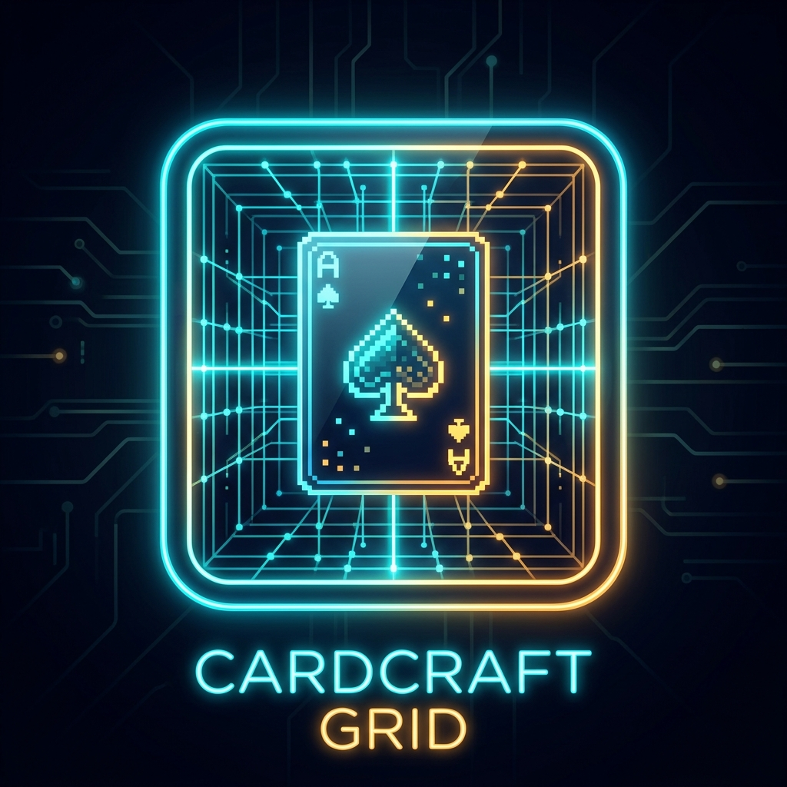
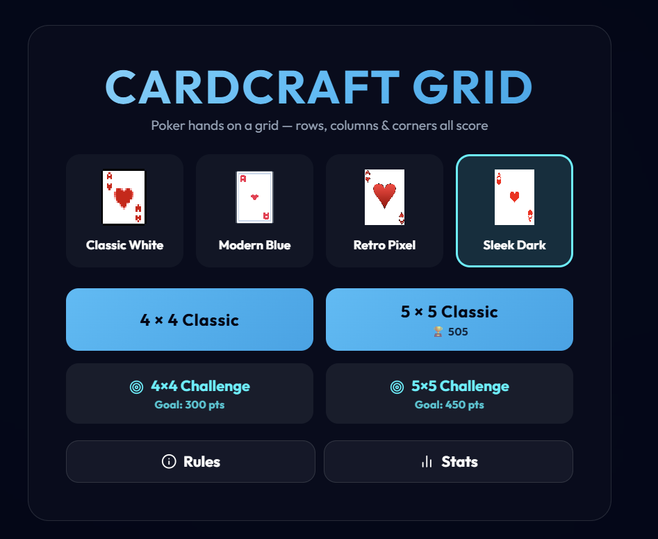
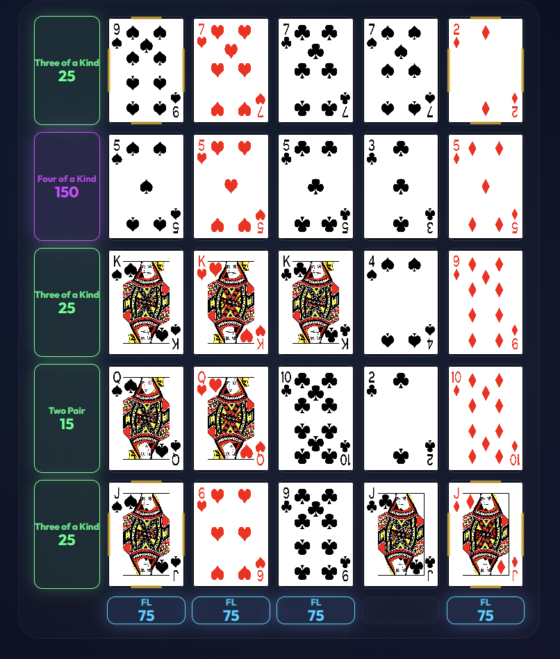

<p align="center">
  
</p>

<p align="center">
  
</p>

# CardCraft Grid

CardCraft Grid is a highly strategic, single-player poker puzzle game. Place cards onto a 4x4 or 5x5 grid to form winning poker hands across rows, columns, and the four corners.

This project uses React, TypeScript, Vite, and Framer Motion to deliver a smooth and responsive experience across both desktop and mobile platforms.

## Features

- **Strategic Gameplay:** Plan ahead to maximize points across overlapping rows and columns.
- **Dynamic Challenges:** Play standard modes for personal bests or tackle challenge modes where target scores dynamically scale based on your past performance.
- **Quality of Life:**
  - Full undo support for your current turn.
  - Keyboard shortcuts (1-5) for rapid placement on desktop.
  - Hover highlights for scoring rows/columns.
  - Discard pile viewer.
- **Progress Tracking:** Tracks your lifetime stats, including win rates, average scores, and challenge completions.
- **Responsive UI:** A deep neon glassmorphic theme that automatically restructures itself for comfortable one-handed play in portrait mobile view.

## Tech Stack

- **Framework:** React 18
- **Language:** TypeScript
- **Styling:** Vanilla CSS (Glassmorphism design)
- **Animation:** Framer Motion
- **Build Tool:** Vite

## Getting Started

To run the game locally:

1. Clone the repository
2. Install dependencies:
   ```bash
   npm install
   ```
3. Start the development server:
   ```bash
   npm run dev
   ```

## How to Play

### The Grid
You are dealt a hand of cards. Your goal is to place them on the grid to form the best possible 5-card poker hands across **Rows**, **Columns**, and the **Four Corners**.

<p align="center">
  
</p>

- **Place Cards:** Click or tap a card in your hand, then click an empty slot on the grid. (Desktop users can press `1-5` to select cards quickly).
- **Undo:** Made a mistake? Click the undo arrow to return the last placed card to your hand.
- **Confirm Turn:** Once you place the required number of cards, confirm your turn. The remaining card in your hand will be discarded, and you will draw a fresh set.

### Scoring
The game evaluates all lines at the end. Royal Flushes, Straight Flushes, and Four of a Kinds yield massive points!

| Hand | Points | Rarity |
| :--- | :--- | :--- |
| **Royal Flush** | 100 | 🟡 Legendary |
| **Straight Flush** | 75 | 🟡 Legendary |
| **Four of a Kind** | 50 | 🟣 Epic |
| **Full House** | 25 | 🟣 Epic |
| **Flush** | 20 | 🔵 Rare |
| **Straight** | 15 | 🔵 Rare |
| **Three of a Kind**| 10 | 🟢 Uncommon |
| **Two Pair** | 5 | 🟢 Uncommon |
| **Pair** | 2 | ⚪ Common |

## License

MIT License
